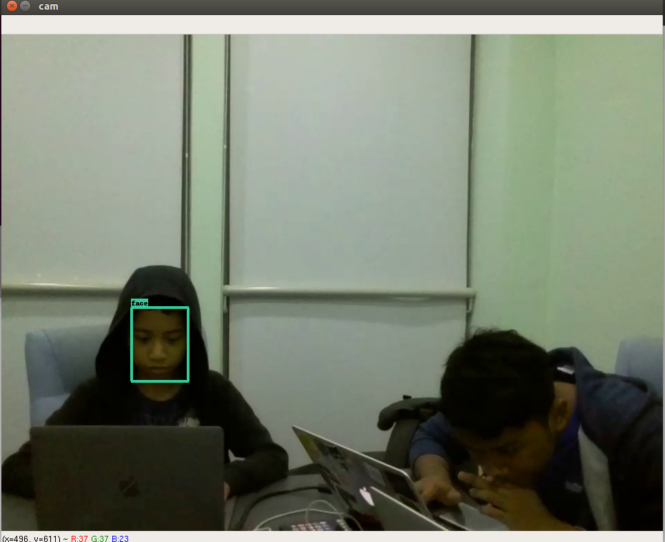

# Tello-Python
tello DGI face recognition using MTCNN with streaming prototype

## Requirement
```bash
pip3 install opencv-contrib-python numpy scipy tensorflow==1.4 flask-socketio socketIO_client
```

## How to run streaming video only
```bash
python3 test_video.py
```

## How to run streaming video + 5 seconds flight + land
```bash
python3 test_flight.py
```

## How to run streaming video + flight + 360 degrees clockwise rotation + land
```bash
python3 test_flight_rotate.py
```

## to run a client listen to video streaming using OpenCV
```bash
python3 client.py

## Output


